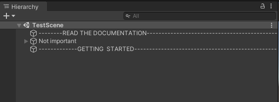
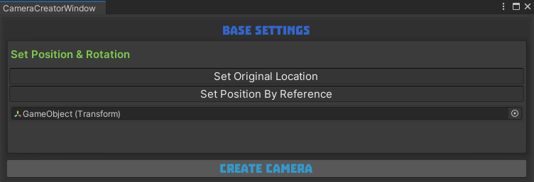
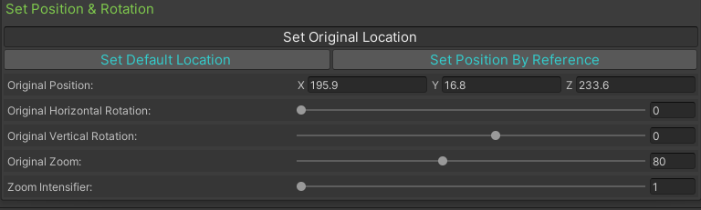

# Overview: <b>BCam Tool</b>

That tool is a complete RTS Camera solution for all kind of projects with keyboard and mouse controls.

-	We have created the definitive RTS Camera tool for all kind of project.

-	With it you can forget about the code, because with the tool you can set all the options of the RTS Camera with an intuitive interface setted with the Camera Controller component at the Camera Rig.

-	The main thing is that you can easily set and change all the configuration with a bunch of options available.

-	You can create the camera by default with the best configuration for the majority of the RTS projects.

BCam is made up of a window for configure the initial settings for the Camera Rig and of a Camera Controller component with a bunch of options for get the best configuration for your RTS Camera.

We have developed a graphical interface, in which without programming, you can easily manage all the settings of the RTS Camera. The tool itself is responsible for automatically set by default the best configuration for all kind of projects.

This component gives you the option to have a triple A camera for all kind of RTS projects, like city builders, roguelikes, battle strategy games, and so on.

# Getting Started

Welcome to the BCam documentation in which you can learn how to implement the RTS Camera for your project rapidly and easily, and how to configure the Camera Controller component to your own belong.
For a better understanding we have prepared a test scene inside the package so that you can see for yourself what it is capable of and how easy it is to configure your perfect RTS Camera.
Go to the package folder, open the Tests folder, and at the Testing Scenes folder you can find the test scene. Open it.

 
Now take a look at the Menu Items at the top of the Unity Window, and select the BCam menu between the component and the window menus. Now click at the Open Window option of the BCam menu.
 

The first step is to configure the RTS Camera and set it a position for before create it.

# BCam Window

Once you open the BCam Window you’ll see this.

 

Here you have to select where the Camera Rig is going to be created. By default, is in the zero of the World. If you want to specify another position, click on the set origin location button.

Now you can change the position vector, or you can click the set position by reference button, and select a reference object for copy that position.

 
Now simply click the create camera button at the bottom of the window.

 
That’s all for create the camera rig in your project. You can now change all the parameters of the Camera Controller component located at the CameraRigX object (the principal pivot of the camera rig).

# Camera Rig

As you can see, all the configuration is setted by default and you can actually play the scene and see how it works. But if you want to change the options of the RTS Camera you can do it with the Camera Controller component.
 

# Camera Controller

This is the first look of the Camera Controller and as you can see you have two buttons for reset the pos to the original position before the start and a button for reset all the fields to the default value. 

Next to them you have the settings window in what you can change the controls of the camera or change the original position.

 

You can uncheck one of the controls of the camera but you always have to maintain one of them active. If you try to uncheck both of them the tool active one of them automatically.

Then you have the set Position & Rotation fields in what you can change the pos by moving the pivot in the scene or you can change all the fields by clicking on the set original location window.

 
Now you can change the position by a vector or by an object reference, the horizontal and vertical rotation, the zoom, and the zoom intensifier (which is a field for get a zoom movement linear or give it an ease in).

If we return to the camera fields, by closing the settings window, we can continue with the configuration.

 
First you have the key input fields, which has by default the WASD keys for the movement, the QE for the horizontal rotation, and IK for the vertical rotation. The inputs for the zoom are RF.

Here you can change the normal speed (by pressing the default keys), and the fast speed (by pressing the shift + default keys). Down you can change the rotation speed too. 

I have to mention that all the green labels have a description if you pass the mouse above them.

 
In the other type of control, you have the mouse control, which by default has the left click for move the camera, and the central click for rotate the camera and pan the area. If you scroll the wheel, you change the zoom too.

First you can change the max speed that you want, because the move adapts the move to the speed of the mouse move when you maintain pressed the left click, and the same for the other inputs.

Down you can change the rotation speed and the max rotation speed too. And you have another option. By default, the type of rotation is setted as panning rotation, but you can uncheck this option.

 
That let you change other options, like the camera inclination or the camera rig inclination (the vertical rotation of the camera with the pivot).
Without the panning now the rotation is going to be only in the Y axis, or what is the same horizontally.

 
The next group of fields are the common fields for both control types. Here you can change the zoom options, and the lerp speed which lerps all the movements of the camera.

 
This is one of the best options, the limit fields, in what you can edit the limits of the area in which the camera can move. You can select two shapes for the limit area, a box (with height and width, regular or not) and the circle (with the radius field).

 
Finally, you can change the check fields, for show the gizmos or change its color.

You can also change the raycasting fields (that raycast make the camera adapt to the terrain and the objects around). You can set proportional or not proportional checking and change the radius of the overlap sphere.

The frontal detection is the size of the sphere that detect objects in front of the camera and readapt the position for avoid overlapping. And the vertical check for adapt the camera to the terrain.

That's all for now, now enjoy the tool :)

** For more info see the tutorial in the asset store page or in our channel of YouTube (BabelGames) **